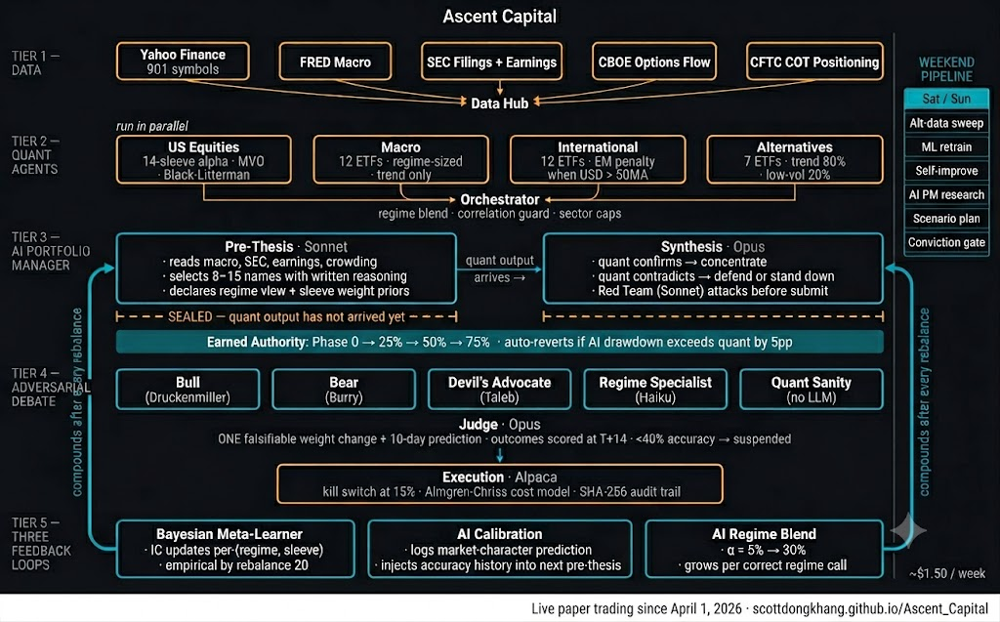

# Ascent Capital


### [📊 Live Performance Dashboard →](https://scottdongkhang.github.io/Ascent_Capital)
> Equity curve vs SPY · Current holdings · Full rebalance debate history · Updates after every daily run.

A live Python trading system with an AI portfolio manager that earns capital allocation by demonstrating measurable edge in live markets.

Paper trading on Alpaca since April 1, 2026.

---

## What this is

Four quantitative agents (US equities, macro, international, alternatives) run in parallel. An AI PM forms an independent investment thesis before seeing quant output. The two are reconciled — the quant can confirm, contradict, or be overridden, but it cannot shape the thesis retroactively. A debate layer reviews every proposed trade before execution.

The AI PM starts with zero allocation. It earns the right to manage capital by outperforming the quant system over 21 rebalances with a Sharpe edge ≥ 0.05, and loses authority automatically if its drawdown exceeds the quant's by 5 percentage points.

---



---

## Design principles

Ascent is structured around three things that require the AI to actually be right over time:

**1. The AI PM forms its thesis before the quant runs.**

The pre-thesis is sealed. Macro data, SEC filings, earnings transcripts → 8–15 conviction names with written reasoning and a regime assessment. The quant agents run after. Where quant confirms the thesis, Opus concentrates. Where quant contradicts, it must defend with new evidence or stand down. Quant-only finds get included only if they fit the thesis. This ordering matters: most AI-quant integrations let the quant run first, then use the AI to post-hoc rationalize the output.

**2. Three compounding feedback loops run after every rebalance.**

- **Bayesian meta-learner**: after each holding period, realized IC of every alpha sleeve updates a per-(regime, sleeve) Gaussian posterior. At rebalance 20, the sleeve weights are fully empirical — the system has learned on its own that, say, the fundamental sleeve adds no value in calm bull markets.
- **AI calibration tracker**: the AI PM predicts the market character before every rebalance. That prediction is logged against realized IC leaders. At the next rebalance, the accuracy track record is injected back into the pre-thesis prompt. After 5+ rebalances, the AI is reasoning from its own performance history.
- **AI regime blend**: the AI PM's regime assessment blends into the HMM's output at weight α, starting at 5%. Every accurate AI regime call increases α by 3pp, capped at 30%. Wrong calls don't increment it.

All three are running in production code, not described in a README.

**3. Every component that makes claims earns the right to make them.**

The adversarial debate engine makes exactly one falsifiable weight change per rebalance and a 10-day prediction. Fourteen days later, the actual outcome is scored. Intervention types below 40% accuracy are suspended. Debate agents see their per-regime historical accuracy injected into their system prompts at each session. The AI PM can only increase its capital allocation by being demonstrably right over 21 consecutive rebalances.

---

## Live Track Record

> Paper trading since April 1, 2026 · AI PM shadow period began May 19, 2026 · **[Full dashboard →](https://scottdongkhang.github.io/Ascent_Capital)**

<!-- LIVE_STATS_START -->
| Metric | Value |
|--------|-------|
| Current NAV | $108,719 |
| Total Return | +7.84% |
| Alpha vs SPY | -6.42% |
| Sharpe (Ann.) | 1.606 |
| Max Drawdown | -6.58% |
| Days Live | 56 |
| Open Positions | 17 |
| Last Updated | 2026-06-23 |
<!-- LIVE_STATS_END -->

*Sharpe standard error over ~62 days is large — not statistically significant. This is tracked honestly, which is why authority is earned over 21 rebalances, not calendar time.*

> **Source of truth:** the only reconciled, source-cited figures live in
> [`CURRENT_VERIFIED_NUMBERS.md`](CURRENT_VERIFIED_NUMBERS.md). The auto-generated table
> above is dashboard-computed; note the **Sharpe (1.794) is not independently verifiable**
> (the underlying daily-return series has an Alpaca-settlement issue) — only the
> **equity-based total return (+8.82%)** is solid. The book trails SPY (~+13%) by ~5pp,
> which is structural, not an AI-layer effect.

| Date | Event |
|------|-------|
| Apr 1, 2026 | Paper trading live · 29 orders · 9 initial positions |
| Apr 15, 2026 | Rebalance #1 · `REDUCE_SIZE` debate verdict · 27 orders |
| May 5, 2026 | Rebalance #2 · Full rotation · 40 orders · NAV $104,815 |
| May 19, 2026 | Rebalance #3 · AI PM shadow begins |
| May 26, 2026 | Adversarial Intelligence live — 3-layer engine, earned authority, one falsifiable change per rebalance |
| May 27, 2026 | AI PM two-phase architecture live (Sonnet pre-thesis + Opus synthesis) |
| May 30, 2026 | Bayesian meta-learner, AI calibration, AI regime blend all wired |
| Jun 1, 2026 | Causal intelligence — PC-algorithm DAG, regime-causal gate, priced-in filter |
| Jun 4, 2026 | AI PM promoted to Level 1 — Analyst · 5% authority budget unlocked |
| Jun 8, 2026 | OpenBB + CBOE/CFTC/Fama-French alpha data · per-ticker memory · StockTwits integration |
| Jun 10, 2026 | AI PM alpha audit (11 findings) — active-weight blend, honest authority scoring, conviction press |
| Jun 10, 2026 | First real AI PM blended portfolio · 31 orders · ai_weight=5% · MiroFish alignment 0.82 bullish |
| Jun 11, 2026 | Inverse-vol tilt + correlation cluster cap · falsifier registry · vol/VIX parity between live and WF |

---

## Walk-Forward Out-of-Sample Results

> Survivorship bias eliminated · fold-local regime fit · rolling 252d-IS / 63d-OOS, 21 folds (21d purge + 5d embargo) · no look-ahead

`walk_forward_runner.py` calls `get_universe_on_date()` on every fold — symbols excluded if outside their validity window at the decision point. Regime engine fitted on training slice only.

> **Verified clean re-run (2026-06-22).** Single source of truth: `CURRENT_VERIFIED_NUMBERS.md`.

| Metric (OOS) | Value |
|---|---|
| Sharpe ratio | **0.41** |
| CAGR | **+10.3%** |
| Excess CAGR vs SPY | **+1.0pp** (strategy 10.4% − SPY 9.4%, same window) |
| Max drawdown | **−32.9%** |
| Beta vs SPY | 0.73 |
| Win rate | 50.2% |
| OOS window | 2021-01-08 → 2026-01-14 (1134 days, 21 folds) |
| Walk-forward efficiency | **−0.65 (overfit flag — see caveat)** |

> Source artifact: `outputs/wf_results/wf_report_clean_2026-06-22.json`, computed on a
> freshly re-fetched single-source price cache (yfinance, adjusted, 936 symbols, **zero
> duplicate rows, zero implausible price jumps**) with the LLM alpha sleeves
> (`llm_fundamental`, `narrative`) zeroed. Sharpe and CAGR were independently re-derived
> from the equity curve (0.417 / +10.4%) and match.
>
> **Honest caveats — read before citing:**
> - **Walk-forward efficiency is negative (−0.65):** the in-sample parameter optimizer adds
>   no out-of-sample value; fixed params would do as well. The Sharpe above is the realistic
>   OOS figure *after* that penalty, but the overfit flag is real and disclosed.
> - This is a **modest** risk-adjusted edge (Sharpe ~0.4) and a **thin** +1pp/yr excess return
>   over SPY at lower beta (0.73, defensive) — a single backtest, **not a live track record**.
> - The engine's reported Sortino (0.04) is **miscomputed** (a known bug, also wrong in the old
>   artifact); the correct value is ~0.68. Do not cite the engine Sortino field.
> - This replaces the earlier "Sharpe 0.483 / CAGR +12.61%" figures, which came from a
>   **corrupted** price cache (~59% duplicate rows + 10×-type errors in 12 symbols) that
>   inflated the result; the old README also showed a −23.4% drawdown and +2.54% alpha that
>   **matched no saved artifact**. See `AUDIT_DATA_INTEGRITY.md`.
>
> **System separation:** this walk-forward record reflects the **pure quant engine only**.
> The AI-native layer (debate, AI PM, counterfactual scoring) has been live since
> **2026-06-04** — about **2.5 weeks**, with **one completed scheduled rebalance (June 10)**
> — and has **no multi-year track record**. Do not attribute any backtest figure to the AI layer.

---

## Quick Start

```bash
python3.12 -m venv .venv && source .venv/bin/activate
pip install -r requirements.txt

python run_all_agents.py            # daily pipeline (auto-detects weekend mode on Sat/Sun)
python run_all_agents.py --dry-run  # full logic, no orders submitted
python -m pytest --tb=short -q     # 777 passed
streamlit run demo_app.py           # interactive investor demo
streamlit run ascent/dashboard/live_dashboard.py --server.port 8502
```

Required environment variables:

```env
ANTHROPIC_API_KEY=...    # Claude Opus/Sonnet/Haiku
ALPACA_KEY=...           # paper trading
ALPACA_SECRET=...
FRED_API_KEY=...         # macroeconomic data
```

---

## System Architecture

```
python run_all_agents.py  ·  daily  ·  1:45 PM ET via launchd
│
├── Weekend detection (Sat/Sun → 11-job intelligence pipeline, once per ISO week)
│   ├── Alt-data full sweep (901 symbols: SEC 10-K/Q · transcripts · Trends)
│   ├── LLM fundamental cache refresh (stale symbols only)
│   ├── ML GridSearch retrain (18 hyperparameter combos → Monday's model)
│   ├── Factor discovery (PySR symbolic regression + LLM proposals → human review)
│   ├── Self-improve (20 variants → shadow promotion if Sharpe edge > 0.05)
│   ├── Conviction gate retrain (logistic regression on matured override history)
│   ├── Adversarial calibration (T+14d outcome scoring for pending interventions)
│   ├── AI PM deep research (Opus · full 901-symbol universe · no trade output)
│   ├── Weekly debrief (Haiku: attribution · AI PM performance · systematic bias)
│   ├── Adversarial scenario plan (6 stress tests · LLM probability + impact assessment)
│   └── Memory ingestion (BM25 semantic memory)
│
├── Outcome fills (every day)
│   ├── Regime memory: realized returns for episodes ≥21 calendar days old
│   ├── Calibration: conviction-vs-realized IC (Spearman)
│   └── Alpha wedge: 21d price fetch → AI PM vs quant delta per override
│
├── Earned authority update (every day, before rebalance/non-rebalance split)
│   └── Sharpe edge ≥0.05 for 21 rebalances → advance phase
│       Drawdown > quant + 5pp → revert to Phase 0
│
├── Data hub (one parallel fetch, all universes)
│   ├── Yahoo Finance: 901 US equities + macro ETFs + international + alternatives
│   ├── FRED: macro time series (cached fallback on outage)
│   └── Alt-data: SEC signals · transcripts · Google Trends
│
├── 4 Specialist Agents (parallel, ThreadPoolExecutor)
│   ├── US Equities    901 symbols · 14-sleeve alpha → MVO/BL → sector constraints
│   ├── Macro          12 ETFs · trend-only · regime-sized (crisis: top 3 / 40%)
│   ├── International  12 ETFs · EM alpha penalty when USD > 50MA
│   └── Alternatives   7 ETFs · trend 80% + low-vol 20% · kill switch at 12%
│
├── Orchestrator
│   ├── Base by regime: calm_bull  US70 / mac10 / intl12 / alt8
│   │                   stressed   US45 / mac25 / intl10 / alt20
│   │                   crisis     US30 / mac30 / intl5  / alt35
│   ├── Skill blend · conviction bonus (+15% when ≥2 agents agree, conv > 0.3)
│   ├── Correlation guard: 63-day cross-agent cap at 0.70 → halve smaller agent
│   ├── Thesis coherence: 12 factor buckets · 6 contradiction pairs → 40% cut
│   ├── EM + commodity hard cap: 20% aggregate
│   ├── Post-blend position cap: 10% per name (single-pass water-fill)
│   └── Crisis veto: merged = 0.60 × macro + 0.40 × merged
│
│ ── NON-REBALANCE ──────────────────────────────────────────────────────────
│
├── Daily Intelligence (9 days accumulate → feeds Monday's rebalance brief)
│   ├── Position health    (pure Python · return/momentum/rank/flag per position)
│   ├── Conviction decay · Signal health · Regime trajectory · Macro calendar
│   ├── Historical analogues (regime + weight pattern matching against episode log)
│   ├── Position thesis monitor (Haiku: flag DETERIORATING positions for review)
│   └── Adversarial challenge (Haiku: worst-case scenario per current position)
│
│ ── REBALANCE ──────────────────────────────────────────────────────────────
│
├── Rebalance brief (Haiku synthesizes 9 days + weekend intel → AI PM's first read)
│
├── AI-Native Learning System (three compounding loops — update each rebalance)
│   ├── Bayesian Meta-Learner (sleeve weights → per-(regime,sleeve) Gaussian posterior)
│   │   ├── Seeded from sleeve_ic_log.jsonl on first run (29 days of real IC data)
│   │   ├── Gaussian conjugate update after each holding period
│   │   └── Kelly weights blended toward regime defaults: α_conf = min(1.0, n/20)
│   ├── AI Calibration (market_character prediction tracking)
│   │   ├── log_thesis(): records market_character before every rebalance
│   │   ├── update_outcome(): fills realized IC leaders at next rebalance
│   │   └── get_context(): injects ~200-token accuracy track record into pre-thesis
│   └── AI Regime Blend (HMM × AI assessment)
│       ├── α starts at 0.05, grows +0.03 when AI call proves accurate, capped at 0.30
│       └── Label override only when α × ai_confidence > 0.50
│
├── AI PM Agent (two-phase · rebalance days only)
│   ├── Pre-thesis (Sonnet · runs BEFORE quant agents)
│   │   ├── Reads: macro · SEC filings · earnings calls · narratives · crowding
│   │   ├── Forms: 8-15 conviction names with written theses (independent of quant)
│   │   └── Declares: regime_assessment · market_character · sleeve_weight_prior
│   ├── Synthesis (Opus · runs AFTER quant agents · 24-tool loop)
│   │   ├── Quant confirms → concentrate (9-10%)
│   │   │   Quant contradicts → defend with new catalyst or stand down
│   │   │   Quant-only finds → include if macro thesis fits
│   │   ├── Conviction gate before every override (win rate check + size friction)
│   │   ├── Red Team: Sonnet attacks per-position delta + systemic kill shot
│   │   └── Revision: Opus defends or revises (max 6 tool calls)
│   └── Post-thesis: calibration.log_thesis() records market_character prediction
│
├── Earned authority blend (Phase 0 → 1 → 2 → 3 · hard cap 0.80)
│
├── Adversarial Intelligence (every rebalance · 3 layers · 1 falsifiable weight change)
│   ├── Layer 1: Short thesis per position (batched Haiku · score 0–1 · >0.6 flagged)
│   ├── Layer 2: Regime-conditional sizing (5 position types × 5 regime states)
│   ├── Layer 3: Narrative coherence (cluster → independent bets · regime flip cost)
│   ├── Judge → ONE position change + falsifiable 10-day prediction
│   └── Authority tiers: win_rate >70% → 4% max change · >50% → 2% · <40% → suspended
│
├── Debate (advisory · 5 agents · 2 rounds · Monte Carlo + weekend scenario injection)
│   ├── Bull: Druckenmiller lens — where is the asymmetry?
│   ├── Bear: Burry lens — what is the weakest number?
│   ├── Devil's advocate: Taleb lens — is this portfolio convex or concave?
│   ├── Regime specialist (Haiku) · Quant sanity checker (no LLM)
│   └── Verdict: proceed / reduce_size (Haiku adjusts weights) / halt_and_review
│
└── Execution
    ├── Kill switch: SOFT_WARN 8% drawdown · HARD_STOP 15% (alternatives: 12%)
    ├── Almgren-Chriss cost model: blocks > 10% ADV, warns > 5% ADV
    ├── Alpaca paper trading: retry ×3, 0.4s inter-order delay
    └── SHA-256 hash-chain audit trail · GIPS TWR monthly reports
```

---

## Alpha Stack — 14 Sleeves

Weights are the `calm_bull` regime defaults from `DEFAULT_ALPHA_WEIGHTS_BY_REGIME` in `ascent/alpha/stack.py`. The Bayesian meta-learner overrides these with empirically derived posteriors as rebalance data accumulates (100% empirical at n=20 per regime). IC gate zeroes any sleeve with rolling mean IC < −0.010.

| Sleeve | calm_bull | stressed/crisis | Signal |
|--------|----------:|----------------:|--------|
| Trend | **58%** | 33–35% | Cross-sectional momentum; `mom_252d − mom_21d` skip-month |
| Stat-arb | **0%** | 15% | Sector-residual mean reversion; zeroed in calm_bull |
| ML (XGBoost/CPCV) | 10% | 10% | C(6,2)=15 folds · 5-day purge + embargo · 12 features |
| Mean Reversion | 5% | 5% | Short-term reversal (z-score, 20-day window) |
| Volatility | 5% | 5% | Long declining+stable vol |
| Fundamental | **0%** | **8%** | Gross profitability + accruals + asset growth; zeroed in calm_bull |
| Earnings (PEAD) | 5% | 5% | EPS surprise z-score · OLS momentum-beta residual |
| Analyst | 5% | 5% | Revision signal; zero-filled when cache absent |
| LLM Fundamental | 3% | 3% | Chicago Booth 6-step CoT via Haiku; cached by (symbol, quarter) |
| Narrative Alpha | 3% | 3% | Quarter-over-quarter thesis shift via Haiku |
| Options Flow | 2% | 2% | IV-adjusted sentiment; sparse |
| Insider | 2% | 2% | Net transaction score; sparse |
| Short Interest | 2% | 2% | Short squeeze signal; sparse |
| Alt Data | 0% | 0% | SEC 10-K · earnings transcripts · Google Trends; 0% until IC gate passes |

---

## Portfolio Construction

```
Alpha scores
  → Distressed filter (zero out mom_252d < −0.65)
  → Black-Litterman blending
      tau scales with IC IR: IR < 0.30 → tau=0.05 · IR < 0.60 → tau=0.10 · else tau=0.15
  → cvxpy MVO (CLARABEL → SCS → rank-weight fallback)
      Objective: maximize w'α − λ(w'Σw) − κ‖w − w_prev‖₁
      Covariance: Σ = B·F·B' + D  (Fama-French 5 + UMD, rolling 252-day OLS)
  → Sector constraints
      max 1 position per sector · skip sector caps if coverage < 80%
  → Post-blend position cap
      10% max per name · single-pass water-fill redistribution
  → SPY 200MA overlay
      multiply all weights × 0.70 when SPY < 200-day moving average
  → VIXY hedge overlay
      0–8% allocation sized by regime × HMM confidence
```

---

## Decision Memory

Every AI PM override is stored with this schema:

```python
{
  "entry_id":              "2026-05-19_SATS",
  "override_type":         "data_quality",
  "regime":                "calm_bull",
  "ai_action":             "REMOVED",
  "ai_weight":             0.0,
  "quant_weight":          0.065,
  "momentum_252d":         31.96,
  "sec_tone":              -0.3,
  "transcript_sentiment":  null,
  "wedge_21d":             null        # auto-filled 21 calendar days later
}
```

The conviction gate reads this history before any future override of the same type and regime:

| Cases | Win Rate | Result |
|-------|----------|--------|
| < 5 | any | Proceed at −15% size |
| ≥ 5 | ≥ 60% + positive wedge | Full size |
| ≥ 5 | ≥ 50% | 75% size |
| ≥ 8 | < 35% | Blocked |

At n ≥ 30 matured cases, a logistic regression trains automatically on the 15-dimensional feature vector.

---

## Weekend Intelligence Pipeline

`run_all_agents.py` auto-detects Saturday/Sunday and runs an 11-job intelligence pipeline. A second run the same weekend skips the once-per-weekend jobs.

| Job | Frequency | Cost driver |
|-----|-----------|-------------|
| Alt-data sweep (901 symbols) | Every run | Haiku · SEC + transcripts |
| LLM fundamental cache | Every run | Haiku · stale symbols only |
| ML GridSearch retrain | Once | No LLM |
| Factor discovery | Once | PySR + Haiku proposals |
| Self-improve (20 variants) | Once | No LLM · `walk_forward_lightweight` |
| Conviction gate retrain | Every run | No LLM · sklearn |
| Adversarial calibration | Every run | No LLM · T+14d outcome scoring |
| AI PM deep research | Once | Opus · full universe · no trade output |
| Weekly debrief | Every run | Haiku |
| Adversarial scenario plan | Every run | Sonnet · 6 scenarios |
| Memory ingestion | Every run | No LLM |

**~$1.50 first run · ~$0.20 second run · ~$6–8/month.**

---

## Regime System

HMM with K=2–4 states (best K selected via walk-forward cross-validation). Labels: `calm_bull`, `stressed`, `crisis`, `neutral`, `uncertain`.

Enter threshold 0.55 · exit threshold 0.35 · minimum dwell 3 days · entropy > 0.90 forces `uncertain`. Particle filter (500-particle SIR) runs continuously; batch refit every 5 days. Emergency refit triggers: SPY −3% + VIX > 30, 200MA cross, SPY/TLT correlation flip.

Regime propagates through sleeve weights, position size caps, orchestrator base allocations, debate context, AI PM episodic memory, and VIXY hedge sizing.

---

## Build Status

| Component | Status | Notes |
|-----------|--------|-------|
| 14-sleeve alpha stack | ✅ live | Regime-conditional weights · Bayesian meta-learner · IC gate |
| MVO + Black-Litterman | ✅ live | CLARABEL → SCS → rank-weight fallback |
| Factor risk model | ✅ live | FF5+UMD rolling OLS · Ledoit-Wolf shrinkage |
| 4 specialist agents | ✅ live | US equities · macro · international · alternatives |
| Multi-agent orchestration | ✅ live | Skill blend · correlation guard · coherence · position cap |
| AI PM — two-phase | ✅ live | Level 1 — Analyst (5% authority) · Sonnet pre-thesis + Opus synthesis |
| Adversarial self-play | ✅ live | Sonnet red team attacks before every AI PM submission |
| Adversarial Intelligence | ✅ live | 3-layer engine · ONE falsifiable change per rebalance · earned authority |
| Debate layer | ✅ live | 5 agents · 2 rounds · Monte Carlo + weekend scenario injection |
| AI-Native Learning System | ✅ live | Bayesian meta-learner · AI calibration · AI regime blend |
| Decision memory | ✅ live | Compounding from May 19 · ML gate at n≥30 |
| Conviction gate | ✅ live | Rules-based now · logistic regression ready at n≥30 |
| Earned authority | ✅ live | Level 1 (5%) → Level 2 (25%) after 21 rebalances with Sharpe edge ≥0.05 |
| Causal Intelligence | ✅ live | PC-algorithm macro DAG · per-symbol causal graph · regime-causal gate |
| Monthly investor letter | ✅ live | Auto-generated on first trading day of each month |
| Anti-hallucination hardening | ✅ live | Anthropic `json_schema` wire-level enforcement on all LLM outputs |
| Self-improve loop | ✅ built | `SELF_MODIFY_ENABLED=False` until positive Sharpe for 30 consecutive days |
| 130/30 long-short | ✅ built | `LONG_SHORT_ENABLED=False` until ≥30 paper rebalances (~Aug 2026) |
| Real capital deployment | 🔧 pending | Targeting live after 12-month paper track record |
| 12-month live track record | 📅 April 2027 | |

---

## Repository Layout

```
ascent/
  config/        settings · types (AgentOutput) · universe (901 symbols)
  data/ingest/   yahoo · fred · sec_filings · earnings_transcripts · google_trends
  features/      build_features · feature_defs (12 ML features)
  alpha/         14 sleeves + stack combiner + meta_learner (Bayesian IC posterior)
  portfolio/     mvo_optimizer · black_litterman · regime_covariance · long_short
  research/      walk_forward_runner · cpcv · self_improve · factor_discovery/
  regime/        hmm engine · particle_filter · breaks · posture
  risk/          factor_model · covariance_model · pm_risk_validator
  execution/     eod_runner · alpaca_broker · kill_switch · slippage_tracker
  monitoring/    position_health · daily_intelligence · rebalance_brief
                 weekend_runner · weekly_debrief · scenario_planner
  strategy/      earned_authority · calibration_tracker · conviction_gate · ai_calibration
  memory/        decision_memory · regime_memory
  llm/           client.py (Opus/Sonnet/Haiku · retry · per-model cost tracking)
  causal/        causal_discovery · dag_builder · compatibility · tracker

agents/          us_equities_agent · macro_agent · international_agent
                 alternatives_agent · ai_pm_agent · red_team_agent
orchestrator/    central_intelligence.py
debate/          adversarial_engine · adversarial_authority · debate_runner · agents · judge
compliance/      audit_trail (SHA-256 hash chain) · performance_report (GIPS TWR)
```

---

## Integrity Constraints

1. **No look-ahead bias** — walk-forward uses `get_universe_on_date()` per fold; regime engine fitted on training slice only; ML targets not leaked into feature windows
2. **No simulated data under live cache names** — fallback writes to `prices_live_fallback_simulated`; cache name always reflects data provenance
3. **Max-weight hard cap** — `_water_fill_cap()` with post-condition check before returning weights
4. **Sector constraint with coverage fallback** — < 80% valid sector labels → skip sector caps + warn; portfolio never collapses to a single sector
5. **Failed folds must be visible** — no silent zero-weight fallback in walk-forward; every failure logs fold date, stage, and exception type
6. **Debate is advisory only** — debate and adversarial engine never write to alpha, portfolio, or execution modules
7. **Alpha sleeve registry** — `DEFAULT_ALPHA_WEIGHTS` exists in both `stack.py` and `self_improve.py`; adding a sleeve requires updating both or integrity tests fail

---

*Built by Scott Dong · Paper trading since April 1, 2026 · Target: 12-month live track record by April 2027*
