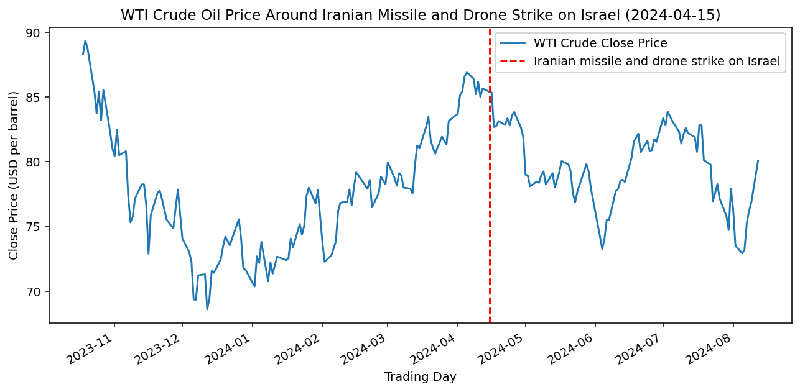

# How did WTI crude and Gold move during Iranian missile and drone strike on Israel (2024-04-15)?

*Event date: 2024-04-15 (Iranian missile and drone strike on Israel)*

## WTI crude price chart

## Asset price moves table

| asset     | +1d   | +5d   | +20d  | +60d  |
| --------- | ----- | ----- | ----- | ----- |
| Gold      | 1.06  | -1.42 | -1.26 | 2.08  |
| WTI crude | -0.06 | -3.0  | -7.36 | -3.27 |

*[asset_moves_table.csv](asset_moves_table.csv)*
