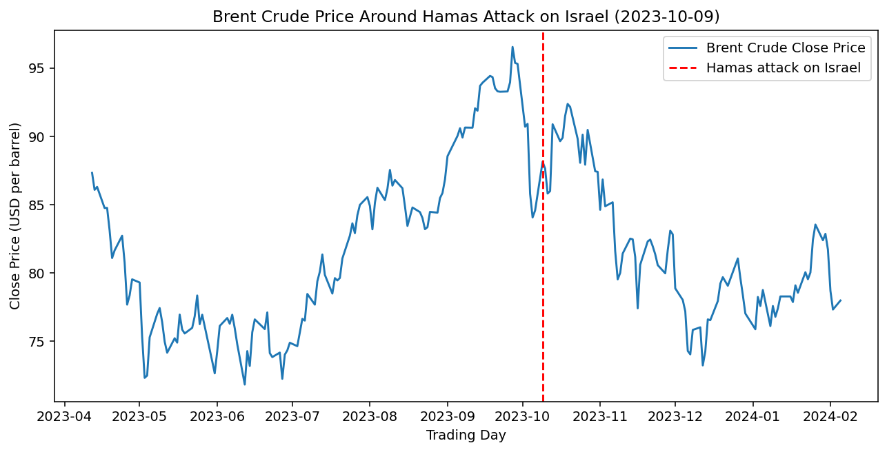

# How did Brent crude and Gold move during Hamas attack on Israel (2023-10-09)?

*Event date: 2023-10-09 (Hamas attack on Israel)*

## Brent crude price chart

## Asset price moves table

| asset       | +1d   | +5d  | +20d  | +60d   |
| ----------- | ----- | ---- | ----- | ------ |
| Brent crude | -0.57 | 1.7  | -3.37 | -11.23 |
| Gold        | 0.62  | 3.87 | 7.14  | 10.42  |

*[asset_moves_table.csv](asset_moves_table.csv)*
