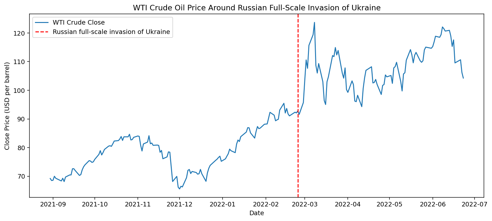

# How did WTI crude and US dollar index move during Russian full-scale invasion of Ukraine (2022-02-24)?

*Event date: 2022-02-24 (Russian full-scale invasion of Ukraine)*

## WTI crude price chart

## Asset price moves table

| asset           | +1d   | +5d   | +20d  | +60d |
| --------------- | ----- | ----- | ----- | ---- |
| US dollar index | -0.54 | 0.67  | 1.7   | 6.19 |
| WTI crude       | -1.31 | 16.01 | 21.04 | 22.0 |

*[asset_moves_table.csv](asset_moves_table.csv)*
